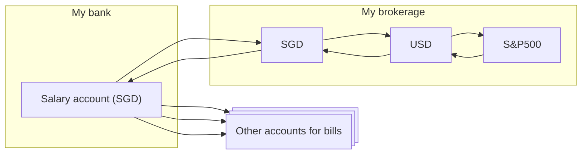

## My monthly finance workflow
Every month, my typical workflow comprises of:
* When I receive my salary, I pay my bills with it. (1)
* The remaining unused amount goes into my savings account which is in investments. (2)
* Alternatively, the salary isn’t adequate and I need some cash from savings to pay off the bills. (3)

I take liberty in simplifying the workflows to ease explanation so I won’t be boring you with my personal financial situation.
## Workflow 1. Salary -> Bills
I go through all the bills that I track in a spreadsheet. I manually update those bill amounts whenever I receive the bills. I track which bills will debit (automatically or manually) from which account.

Where can automation help:
* Display all the upcoming transactions or bills planned to be debited on my account and when.
* Alert me if I have upcoming debit where my account doesn’t have enough money.

Aside:
* With all the blockchain credit cards out there, I don’t see one that solves for the automations above.
* Very few banks offer banking APIs to the *individual* (attach Aussie one here)
* Even fewer credit cards companies offer APIs to fetch statement balance. (I don’t know of any)

## Workflow 2. Remaining salary -> Savings
After calculating and allocating for my bills, the remaining amounts go into my savings accounts. These accounts can include investments. For simplicity, let’s assume I have my savings in an S&P 500 ETF like SPY.

Steps:
1. Transfer remaining salary, $500 in Singapore dollars into broker (e.g. IBKR).
2. Wait a day for the money to be deposited (cleared). 
3. Convert the $500 Singapore dollars to ~$360[^1] US dollars for investing into SPY, a USD-denominated ETF.
4. Set a purchase of SPY for ~$360.

Where automation can help:
* Similar to Workflow 1 above, the brokerage can take an automatic action after the money is deposited — convert the SGD to USD.
* Create the SPY order based on converted USD amount 
* Orchestrate both orders — USD conversion and SPY order.

Where we’re at today:
* IBKR has a Recurring Investments feature. My friend Dexter uses these in small increments to deploy his savings that are in IBKR.
* Services like Endowus (Singapore) or Wealthfront (US) abstract away these operations. However, I lose granular control over exact ETFs bought and incur additional fees.

## Workflow 3. Savings -> Bills
Sometimes the salary doesn’t cover all the bills. I sell my SPY stock and route the sales proceeds to the account for the bill. This looks like the reverse of Workflow 2.

[^1]: Going by the Google FX rate as of this writing. 
